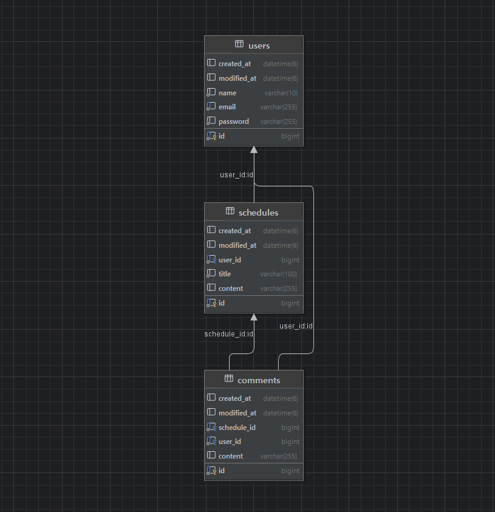

<h1>ERD</h1>


<h1>디렉토리</h1>


    src
    ├── main
    │   └── java
    │       └── com.example.schedulerdevelop
    │           ├── global             
    │           │   ├── config           
    │           │   ├── customConst    
    │           │   ├── dto               
    │           │   ├── entity             
    │           │   ├── exception         
    │           │   ├── handler            
    │           │   └── security           
    │           ├── scheduler             
    │           │   ├── comment            
    │           │   │   ├── controller
    │           │   │   ├── dto
    │           │   │   ├── entity
    │           │   │   ├── repository
    │           │   │   └── service
    │           │   ├── schedule          
    │           │   │   ├── controller
    │           │   │   ├── dto
    │           │   │   ├── entity
    │           │   │   ├── repository
    │           │   │   └── service
    │           │   └── user              
    │           │       ├── controller
    │           │       ├── dto
    │           │       ├── entity
    │           │       ├── repository
    │           │       └── service
    │           └── SchedulerDevelopApplication.java  
    ├── resources                          
    └── test                               
    └── java
    └── com.example.schedulerdevelop
    └── SchedulerDevelopApplicationTests.java

<h1>API 명세서</h1>

SwaggerUI: http://localhost:8080/swagger-ui/index.html#/

## 회원 관리 API

| 기능 | Method | URL | 설명 |
|------|--------|-----|------|# API 명세서

## 1. 일정 관리 API

### 1.1 일정 등록
**URL:** `POST /schedules`

#### REQUEST BODY
```json
{
    "title": "String (최대 30자, 필수)",
    "content": "String (최대 200자, 필수)",
    "name": "String (필수)",
    "password": "String (필수)"
}
```

#### RESPONSE STATUS CODE
| 코드 | 설명 |
|------|------|
| 201 | 생성 성공 |
| 400 | 잘못된 요청 |
| 500 | 서버 오류 |

#### RESPONSE
```json
{
    "id": 1
}
```

---

### 1.2 일정 단건 조회
**URL:** `GET /schedules/{scheduleId}`

#### RESPONSE STATUS CODE
| 코드 | 설명 |
|------|------|
| 200 | 조회 성공 |
| 400 | 잘못된 요청 |
| 404 | 존재하지 않는 일정 |
| 500 | 서버 오류 |

#### RESPONSE
```json
{
    "getResponse": {
        "id": 1,
        "title": "제목",
        "content": "내용",
        "name": "이름",
        "createdAt": "생성 시간",
        "modifiedAt": "수정 시간"
    },
    "comments": [
        {
            "id": 1,
            "scheduleId": 1,
            "content": "댓글 내용",
            "name": "댓글 작성자 이름",
            "createdAt": "댓글 생성 시간",
            "modifiedAt": "댓글 수정 시간"
        }
    ]
}
```

#### ERROR CASE
```json
{
    "message": "오류: 존재하지 않음",
    "status": 404
}
```

---

### 1.3 사용자 이름으로 일정 조회
**URL:** `GET /schedules?name={userName}`

#### RESPONSE STATUS CODE
| 코드 | 설명 |
|------|------|
| 200 | 조회 성공 |
| 400 | 잘못된 요청 |
| 404 | 존재하지 않는 일정 |
| 500 | 서버 오류 |

#### RESPONSE
```json
[
    {
        "id": 1,
        "title": "제목",
        "content": "내용",
        "name": "사용자 이름",
        "createdAt": "생성 시간",
        "modifiedAt": "수정 시간"
    },
    {
        "id": 2,
        "title": "제목2",
        "content": "내용2",
        "name": "사용자 이름",
        "createdAt": "생성 시간",
        "modifiedAt": "수정 시간"
    }
]
```

#### ERROR CASE
```json
{
    "message": "오류: 해당하는 일정이 없습니다.",
    "status": 404
}
```

---

### 1.4 일정 전체 조회
**URL:** `GET /schedules/all`

#### RESPONSE STATUS CODE
| 코드 | 설명 |
|------|------|
| 200 | 조회 성공 |
| 400 | 잘못된 요청 |
| 404 | 존재하지 않는 일정 |
| 500 | 서버 오류 |

#### RESPONSE
```json
[
    {
        "id": 1,
        "title": "제목",
        "content": "내용",
        "name": "이름",
        "createdAt": "생성 시간",
        "modifiedAt": "수정 시간"
    }
]
```

#### ERROR CASE
```json
{
    "message": "오류: 일정이 없습니다.",
    "status": 404
}
```

---

### 1.5 일정 수정
**URL:** `PUT /schedules/{scheduleId}`

#### REQUEST BODY
```json
{
    "title": "String (최대 30자, 필수)",
    "content": "String (최대 200자, 필수)",
    "name": "String (필수)",
    "password": "String (필수)"
}
```

#### RESPONSE STATUS CODE
| 코드 | 설명 |
|------|------|
| 200 | 수정 성공 |
| 400 | 잘못된 요청 |
| 403 | 비밀번호 불일치 |
| 404 | 존재하지 않는 일정 |
| 500 | 서버 오류 |

#### RESPONSE
```json
{
    "id": 1,
    "title": "수정된 제목",
    "content": "수정된 내용",
    "name": "이름",
    "modifiedAt": "수정 시간"
}
```

#### ERROR CASE
```json
{
    "message": "오류: 비밀번호 불일치",
    "status": 403
}
```
```json
{
    "message": "오류: 존재하지 않음",
    "status": 404
}
```
**URL:** `DELETE /schedules/{scheduleId}`

#### REQUEST BODY
```json
{
    "password": "String (필수)"
}
```

#### RESPONSE STATUS CODE
| 코드 | 설명 |
|------|------|
| 204 | 삭제 성공 |
| 400 | 잘못된 요청 |
| 403 | 비밀번호 불일치 |
| 404 | 존재하지 않는 일정 |
| 500 | 서버 오류 |

#### ERROR CASE
```json
{
    "message": "오류: 비밀번호 불일치",
    "status": 403
}
```
```json
{
    "message": "오류: 존재하지 않음",
    "status": 404
}
```

---

## 2. 회원 관리 API

### 2.1 회원 가입
**URL:** `POST /signup`

#### REQUEST BODY
```json
{
    "username": "String (필수)",
    "email": "String (필수)",
    "password": "String (필수)"
}
```

#### RESPONSE STATUS CODE
| 코드 | 설명 |
|------|------|
| 201 | 생성 성공 |
| 400 | 잘못된 요청 |
| 409 | 중복된 이메일 |
| 500 | 서버 오류 |

#### RESPONSE
```json
{
  "id": 1,
  "name": "사용자명",
  "email": "user@example.com",
  "createdAt": "생성 시간",
  "modifiedAt": "수정 시간"
}
```

#### ERROR CASE
```json
{
    "message": "이미 존재하는 이메일입니다.",
    "status": 409
}
```

---

### 2.2 로그인
**URL:** `POST /login`

#### REQUEST BODY
```json
{
    "email": "String (필수)",
    "password": "String (필수)"
}
```

#### RESPONSE STATUS CODE
| 코드 | 설명 |
|------|------|
| 200 | 로그인 성공 |
| 401 | 인증 실패 |
| 500 | 서버 오류 |

#### RESPONSE
```json
{
  "id": 1,
  "name": "사용자명",
  "email": "user@example.com",
  "createdAt": "생성 시간",
  "modifiedAt": "수정 시간"
}
```

#### ERROR CASE
```json
{
    "message": "비밀번호가 일치하지 않습니다.",
    "status": 401
}
```

---

### 2.3 로그아웃
**URL:** `POST /logout`

#### RESPONSE STATUS CODE
| 코드 | 설명 |
|------|------|
| 200 | 로그아웃 성공 |
| 401 | 인증 실패 |
| 500 | 서버 오류 |

#### RESPONSE
```json
{
    "message": "로그아웃 되었습니다."
}
```

---

### 2.4 유저 조회
**URL:** `GET /users/{userId}`

#### RESPONSE STATUS CODE
| 코드 | 설명 |
|------|------|
| 200 | 조회 성공 |
| 404 | 존재하지 않는 유저 |
| 500 | 서버 오류 |

#### RESPONSE
```json
{
    "id": 1,
    "name": "사용자명",
    "email": "user@example.com",
    "createdAt": "생성 시간",
    "modifiedAt": "수정 시간"
}
```

#### ERROR CASE
```json
{
    "message": "유저를 찾을 수 없습니다.",
    "status": 404
}
```

---

### 2.5 유저 수정
**URL:** `PUT /users/{userId}`

#### REQUEST BODY
```json
{
    "name": "String (선택)",
    "email": "String (선택)",
    "password": "String (필수, 인증용)",
    "newPassword": "String (선택)"
}
```

#### RESPONSE STATUS CODE
| 코드 | 설명 |
|------|------|
| 200 | 수정 성공 |
| 400 | 잘못된 요청 |
| 403 | 비밀번호 불일치 |
| 404 | 존재하지 않는 유저 |
| 500 | 서버 오류 |

#### RESPONSE
```json
{
    "id": 1,
    "name": "수정된 사용자명",
    "email": "updated@example.com",
    "createdAt": "생성 시간",
    "modifiedAt": "수정 시간"
}
```

#### ERROR CASE
```json
{
    "message": "비밀번호 불일치",
    "status": 403
}
```
```json
{
    "message": "유저를 찾을 수 없습니다.",
    "status": 404
}
```

---

### 2.6 회원 탈퇴
**URL:** `DELETE /users/{userId}`

#### REQUEST BODY
```json
{
    "password": "String (필수)"
}
```

#### RESPONSE STATUS CODE
| 코드 | 설명 |
|------|------|
| 204 | 삭제 성공 |
| 403 | 비밀번호 불일치 |
| 404 | 존재하지 않는 유저 |
| 500 | 서버 오류 |

#### ERROR CASE
```json
{
    "message": "비밀번호 불일치",
    "status": 403
}
```
```json
{
    "message": "유저를 찾을 수 없습니다.",
    "status": 404
}
```

---

### 2.7 유저 전체 조회
**URL:** `GET /users`

#### RESPONSE STATUS CODE
| 코드 | 설명 |
|------|------|
| 200 | 조회 성공 |
| 500 | 서버 오류 |

#### RESPONSE
```json
[
    {
        "id": 1,
        "name": "사용자1",
        "email": "user1@example.com",
        "createdAt": "생성 시간",
        "modifiedAt": "수정 시간"
    },
    {
        "id": 2,
        "name": "사용자2",
        "email": "user2@example.com",
        "createdAt": "생성 시간",
        "modifiedAt": "수정 시간"
    }
]
```

---

## 3. 댓글 관리 API

### 3.1 댓글 생성
**URL:** `POST /schedules/{scheduleId}/comments`

#### REQUEST BODY
```json
{
    "content": "String (최대 100자, 필수)",
    "name": "String (필수)",
    "password": "String (필수)"
}
```

#### RESPONSE STATUS CODE
| 코드 | 설명 |
|------|------|
| 201 | 생성 성공 |
| 400 | 잘못된 요청 |
| 404 | 존재하지 않는 일정 |
| 500 | 서버 오류 |

#### RESPONSE
```json
{
    "id": 1
}
```

---

### 3.2 댓글 수정
**URL:** `PUT /schedules/{scheduleId}/comments/{commentId}`

#### REQUEST BODY
```json
{
    "content": "String (최대 100자, 필수)",
    "password": "String (필수)"
}
```

#### RESPONSE STATUS CODE
| 코드 | 설명 |
|------|------|
| 200 | 수정 성공 |
| 400 | 잘못된 요청 |
| 403 | 비밀번호 불일치 |
| 404 | 존재하지 않는 댓글 |
| 500 | 서버 오류 |

#### RESPONSE
```json
{
    "id": 1,
    "scheduleId": 1,
    "content": "수정된 댓글 내용",
    "name": "작성자 이름",
    "createdAt": "생성 시간",
    "modifiedAt": "수정 시간"
}
```

#### ERROR CASE
```json
{
    "message": "비밀번호 불일치",
    "status": 403
}
```
```json
{
    "message": "존재하지 않음",
    "status": 404
}
```

---

### 3.3 댓글 삭제
**URL:** `DELETE /schedules/{scheduleId}/comments/{commentId}`

#### REQUEST BODY
```json
{
    "password": "String (필수)"
}
```

#### RESPONSE STATUS CODE
| 코드 | 설명 |
|------|------|
| 204 | 삭제 성공 |
| 400 | 잘못된 요청 |
| 403 | 비밀번호 불일치 |
| 404 | 존재하지 않는 댓글 |
| 500 | 서버 오류 |

#### ERROR CASE
```json
{
    "message": "비밀번호 불일치",
    "status": 403
}
```
```json
{
    "message": "존재하지 않음",
    "status": 404
}
```

---

## 공통사항

댓글 개수 일정당 10개

일정 및 댓글의 생성, 수정, 삭제에는 로그인 필요
